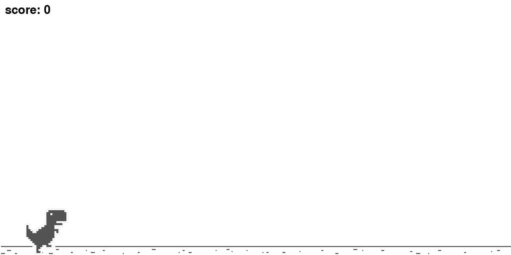

# Playing Chrome's Dinosaur Game with DQN

## Introduction

This project implements and trains an agent to play the [Dinosaur Game](https://en.wikipedia.org/wiki/Dinosaur_Game) using [Deep Q Network (DQN)](https://en.wikipedia.org/wiki/Q-learning#Deep_Q-learning). The network architecture for **DQN** to train the agent is similar to what proposed in the [original paper](https://www.deepmind.com/publications/playing-atari-with-deep-reinforcement-learning).

The project also implements a custom [gymnasium](https://gymnasium.farama.org) (previously _OpenAI gym_) environment for training a reinforcement learning agent to play the Dinosaur Game. For more details, see the `envs.py` file.

**Note**: this environment is a simplified replication of the Dinosaur Game, hence missing some features/game mechanisms.

## Setup

The project is implemented in **Python** and it uses [Poetry](https://github.com/python-poetry/poetry) for package management.

```shell
git clone https://github.com/aome510/chrome-dino-game-rl.git
cd chrome-dino-game-rl
poetry install
```

Then run `poetry shell` to spawn a shell within the virtual environment containing the project's dependencies.

**Note**: this project specifies **Python** version `3.11.*`. To use another **Python** version, please update `pyproject.toml` accordingly.

### Usage

- `python train.py` to train the DQN model. Changes the parameters of the `Trainer` class to train the agent differently.
- `python play.py human` to play the game manually with keyboard.
- `python play.py ai -m model.pth` to play the game with an agent (using the parameters from `model.pth`).
- `python experiment.py` to run experiments with the trained agent. Refer to the file for more details on its usage.

## Results

The agent is trained in **1000** episodes. The plot displaying the agent's results after `x00` episodes:


The reward is defined to be the number of obstacles that the agent passes before colliding one.

The model's best parameters (based on the result plot) can be found in the `model.pth` file.

### Examples

Example plays of the agent after 100,300,500,700,900 episodes in the same environment:

- after **100** episodes
  
- after **300** episodes
  
- after **500** episodes
  
- after **700** episodes
  
- after **900** episodes
  

## Acknowledgement

The images in the [assets](./assets/) folder are from the [Chrome-Dino-Runner](https://github.com/dhhruv/Chrome-Dino-Runner/tree/master/assets) repo.
